## Install Python

If you do not know how to open the terminal on your operating system, this tutorial is going to be too difficult for you to complete and you should keep scrolling on Instagram / Tiktok.

### Check if python is already installed

Run the command `python -V` in your terminal.

```bash
python -V
```

### Linux 🔥 / Mac 🤮 / Windows 🤮 Terminal Output

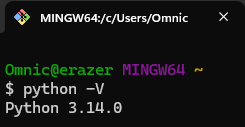

If the terminal tells you you do not have python, then download and install the [latest version of Python](https://www.python.org/downloads/).

Once python is installed, try to run the command to check it's version again **AFTER RESTARTING THE TERMINAL**. If the windows terminal has permission issues, this is why we don't develop with windows, idk use ai, google, or just message me for help 😭.

## Create the project folder

If you do not have a dedicated projects folder just use the documents folder on your computer. Open your projects/documents folder in the terminal.

```bash
cd Documents
```

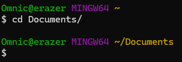

If you are cool, you should create a projects folder in your Documents or Home folder.

```bash
# run one or the other NOT BOTH
mkdir dev 

mkdir projects 
```

Then use `cd` to go to your projects folder.

I promise this is the last folder you have to create. Create a folder for the project itself, likely named `discord-rpc` and navigate to it using `cd`.

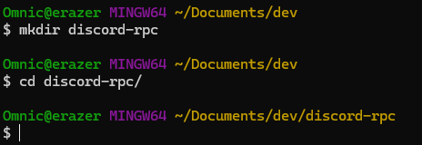

## Create a python virtual envrionemnt (mandatory not optional)

If you install alot of python packages globally on your system, eventually your installed python packages list will become really messy. This can result in package dependency issues across multiple current and future projects. (Yapping ahead) I would never judge someone by their tidyness, but I find that people who have messy virtual environments e.g. phone or desktop screens with icons everwhere, are also likely to have messy physical environemnts.

So lets atleast have a tidy python environemnt 😊.

Run `python -m venv .venv`

```bash
python -m venv .venv
```

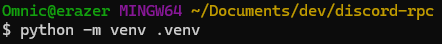

## Activate the virtual environment

Keep note that you will have to re-activate the virtual environment if you close your terminal and want to have a custom game being played again.

### Linux / Mac

```bash
    source .venv/bin/activate
```

### Windows

```bash
    # if you are using command prompt
    .venv\Scripts\activate.bat

    # if you are using power shell
    .venv\Scripts\Activate.ps1

    # if you are using git bash
    source .venv/Scripts/activate
```

### Terminal Output

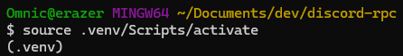

You should see `(.venv)` in your terminal output lines, either at the end of your input, or before the directory is listed on the first line.

## Install [Pypresence](https://github.com/qwertyquerty/pypresence)

With your virtual envrionemnt running, follow the steps above if it is not, run `pip install pypresence`. Look out for typos, pro hackers create malicious versions of packages with mistyped letters for the python package system.

```bash
pip install pypresence
```

### Terminal Output

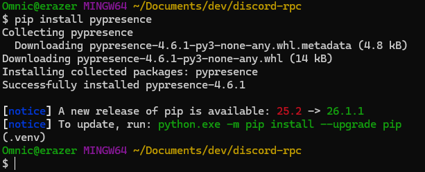

Ignore the notice warnings on my non up-to-date version of pip 😭.

## Create a python file for GTA VI

### Linux / mac

```bash
touch gtavi.py
```

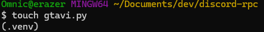

### Windows

Just go to the discord-rpc folder you created but in your file explorer and manually create the file `gtavi.py` there 😭.

## Open the file in a code editor

Open gtavi.py in vscode, codium, webstorm, or just note pad 🤮. Copy paste the code adapted from this [example](https://github.com/qwertyquerty/pypresence/blob/master/examples/rich-presence-custom-name.py) into gtavi.py.

```py
import time

from pypresence import Presence

client_id = "717091213148160041"  # Fake ID, put your real one here
RPC = Presence(client_id)  # Initialize the client class
RPC.connect()  # Start the handshake loop

print(
    RPC.update(
        details="Playing Story Mode",
    )
)  # Set the presence

while True:  # The presence will stay on as long as the program is running
    time.sleep(15)  # Can only update rich presence every 15 seconds
```

We will soon replace the client_id variable.

## Create a Discord application

Go to [Discord Developer Portal](https://discord.com/developers/home), go to applications and click create new application.

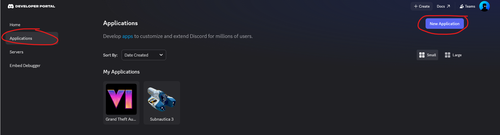

Name the application GTA VI.

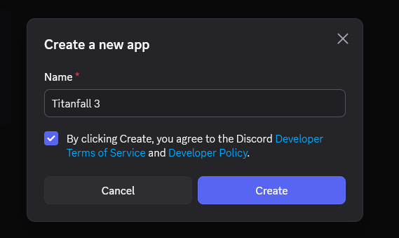

Copy the Application ID and Change the Icon

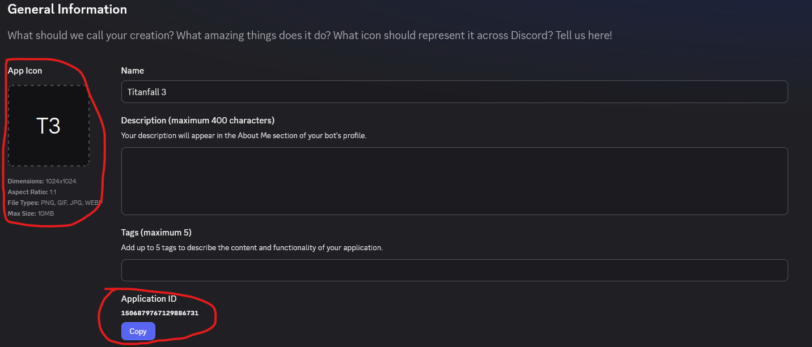

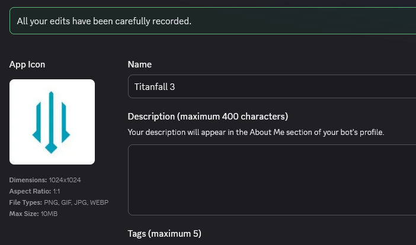

Go back to your editor and paste the Application ID. **Save the file if it has not been**

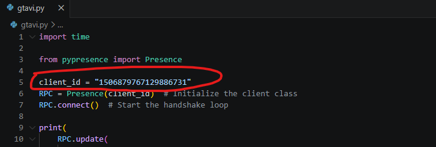

## Run the Python file

Open Discord. Run `python gtavi.py` in the terminal by typing it with the virtual environment running.

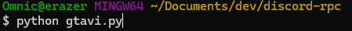

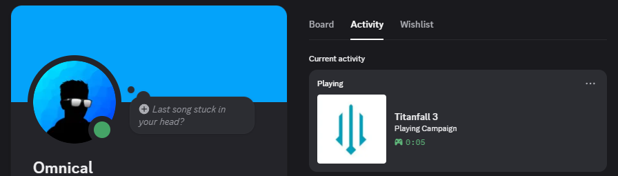